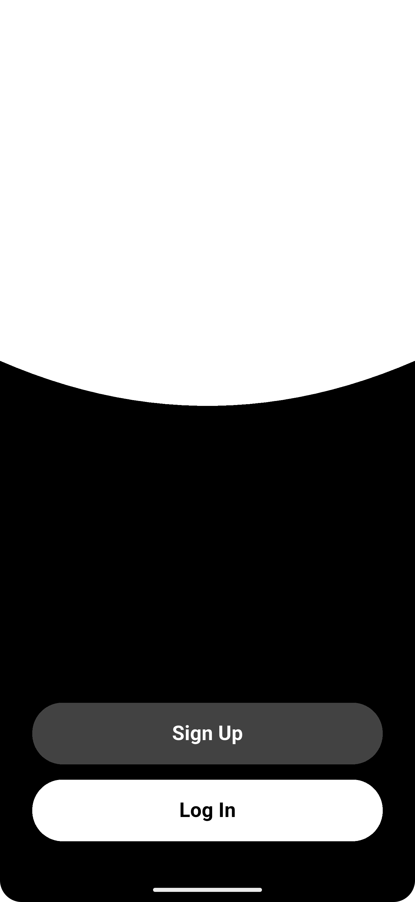
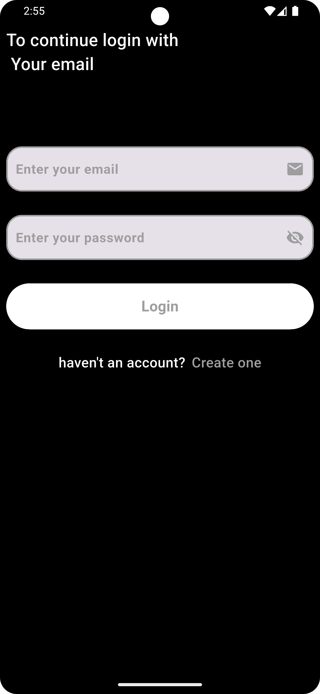
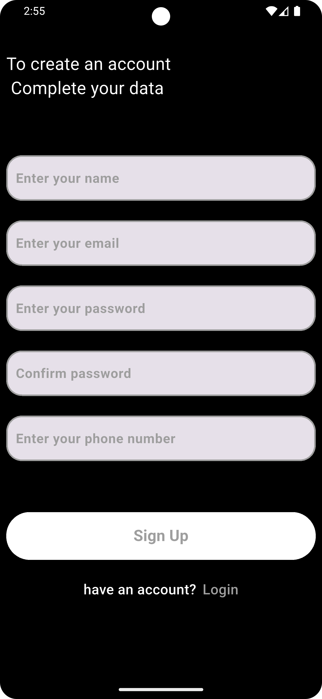
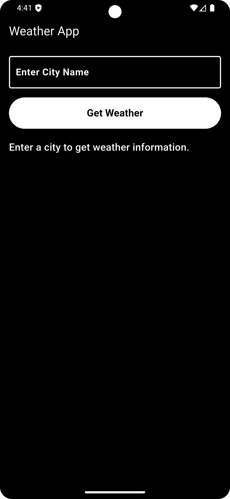
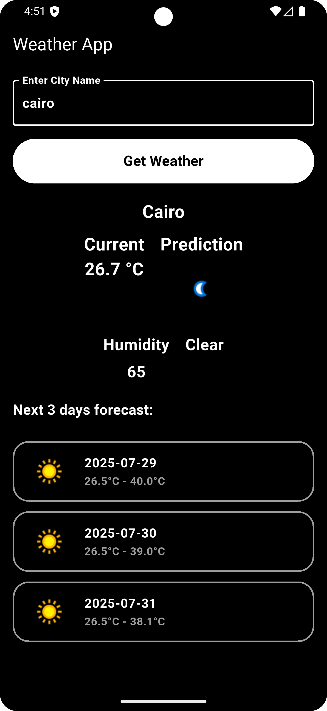

📸 Screenshots

  
  
  
  
  

## 🌟 Overview

Weather applications are software tools designed to provide users with up-to-date and accurate information about current and future weather conditions,
often leveraging data from meteorological sources, satellites, and weather stations to deliver forecasts,
real-time updates, and additional features like radar maps, widgets, and alerts for severe weather.

## 🚀 Features

- 📜 **Weather Details:** Fetch and display all details using a RESTful API.
- 📱 **Responsive UI:** Optimized for both phones and tablets.
- 🌙 **Weather Design Touch:** Minimal and calm user interface aligned with the purpose of the app.
- ⚡ **Smooth Performance:** Built with best practices to ensure fast loading and responsiveness.

---

